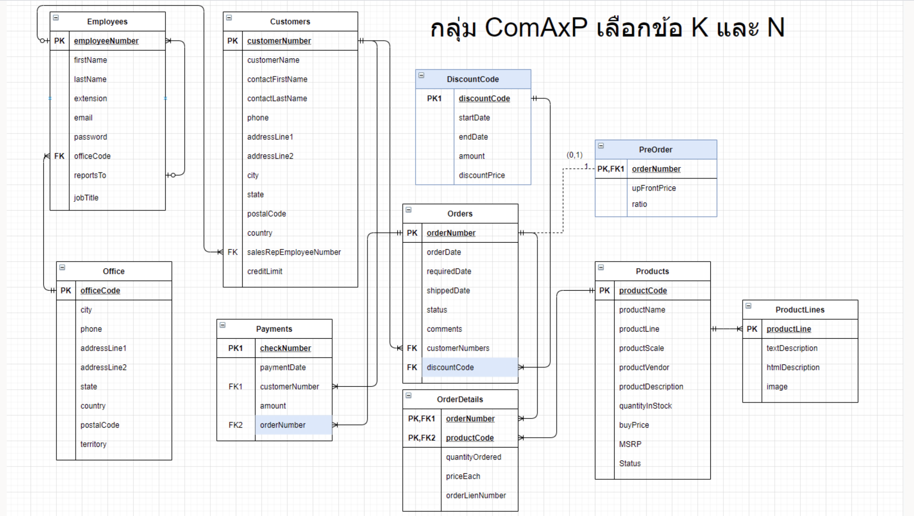

### CPE342-343 Database Systems Final Project

## Requirements
* [A] The website has a products catalog which categorizes by product vendors and product scale. The catalog is displayed publicly. (Group by)
* [B] Employees can log in with a unique employee number and password. Any password in the system might not be stored as plaintext. (การเก็บ password)
* [C] Employees in the sales department, who have "sale" in their job title can access a stock-in system (ระบบรับสินค้าเข้า), which records the date, and amount of product in each lot as well as create, update, and delete products. 
* [D] When customers buy any product will get 3 member points for every $100 spent. The system must show the total points they have and how many points get from each order. 
* [E] In this application, employees will place an order for customers by adding products to one order and enter a customer who buys it. Every order will have "in progress" as a default status. If customers have a preferred shipping date, it will be set in "required date." Employees can edit some columns later, which are shipped date, status, and comments. (การ Key ข้อมูล)
* [F] Before customers can place an order, they need to be a member first. Employees will key customer's personal information to the system.
* [G] A payment system is an old-school method. After the order was placed, customers will make payments using a money cheque. Then, employees will note the payment cheque in a table "payments." Once a package is ready, the order status will change to "shipped."
* [H] The order can have six statuses which are: canceled, disputed (ผู้รับปฏิเสธการรับของ เช่น ของไม่ครบ, เสียหาย, ส่งผิด), in process, on hold, resolved (เคยเกิดปัญหา แต่แก้ไขเรียบร้อยแล้ว), and shipped.
* [I] There is an employee resource management (ERM) feature. This feature allows sales departments to manage their employees. Such as VP sales can promote and demote between sales managers and sales reps.

## Entity Relationship Diagram

## Source Links
>> [Front-End Design](https://www.figma.com/file/8FgUeychlmIqn0tGLKPz4A/Plastic-Model-Shop?node-id=0%3A1)